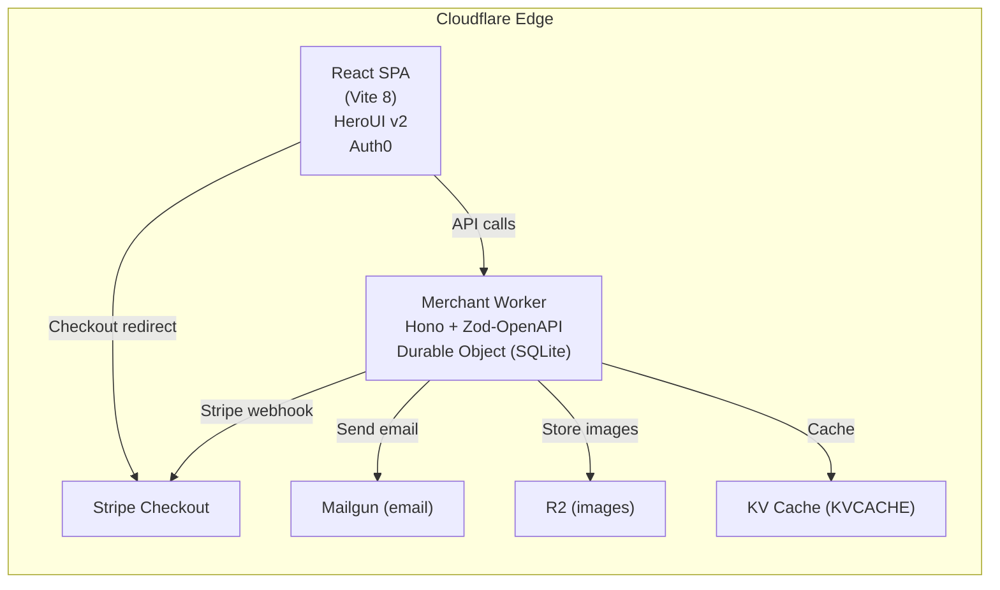

# Fufuni — E-Commerce Platform

> **Cloudflare-native headless commerce** — Workers · Durable Objects · React · HeroUI


[](https://workers.cloudflare.com)
[](https://www.typescriptlang.org/)
[](https://react.dev/)
[](https://www.heroui.com/)
[](https://auth0.com/)
[](https://www.gnu.org/licenses/agpl-3.0)

Fufuni is a **production-ready e-commerce engine** built entirely on Cloudflare primitives.
A single Durable Object backed by SQLite holds your entire store state — no external database, no cold starts, globally consistent.

---

## Star the project

**If you appreciate my work, please consider giving it a star! 🤩**

---

## Live Demo

Click the screenshot below to try the public deployment. You can checkout with [any Stripe test card](https://docs.stripe.com/testing#cards) for example `4242 4242 4242 4242` (any future expiry, CVC, and ZIP) — no real charges will be made.

[](https://sctg-development.github.io/fufuni)

Visitors see an attractive landing page with a Log in button and direct links to a sample API and autogenerated OpenAPI/Swagger docs — no auth required to view the interface.

---

## Table of Contents

- [Features](#features)
- [Architecture](#architecture)
- [Quick Start](#quick-start)
- [Configuration Reference](#configuration-reference)
  - [wrangler.jsonc — Variables](#wranglerjsonc--variables)
  - [Frontend `.env`](#frontend-env)
- [API Reference](#api-reference)
  - [Authentication](#authentication)
  - [Products & Variants](#products--variants)
  - [Inventory](#inventory)
  - [Cart & Checkout](#cart--checkout)
  - [Shipping](#shipping)
  - [Orders](#orders)
  - [Customers & Addresses](#customers--addresses)
  - [Discounts](#discounts)
  - [Regions, Currencies & Countries](#regions-currencies--countries)
  - [Warehouses](#warehouses)
  - [Shipping Classes & Rates](#shipping-classes--rates)
  - [Webhooks](#webhooks)
  - [Images](#images)
  - [Mail (test)](#mail-test)
  - [Auth0 helpers](#auth0-helpers)
  - [AI parameters](#ai-parameters)
  - [Setup & config](#setup--config)
- [Database Schema](#database-schema)
  - [Migrations](#migrations)
- [Shipping System](#shipping-system)
  - [Shipping Classes](#shipping-classes)
  - [Cart Weight Calculation](#cart-weight-calculation)
  - [Rate Filtering Logic](#rate-filtering-logic)
- [Multi-Region & Multi-Currency](#multi-region--multi-currency)
- [Authentication & Security](#authentication--security)
- [AI Translation](#ai-translation)
- [Internationalisation](#internationalisation)
- [Admin Panel](#admin-panel)
- [Deployment](#deployment)
- [Contributing](#contributing)
- [License](#license)

---

## Features

### 🛍 Products & Catalog
- Product catalogue with variants, SKUs and **per-variant multi-currency pricing**
- **Multilingual product titles** — plain text or JSON per locale, with AI translation
- **Multilingual product descriptions** — rich HTML (Tiptap editor) or JSON per locale, with AI translation
- RTL language support (Arabic, Hebrew)
- Product image management via **Cloudflare R2**
- Inventory management across **multiple warehouses**
- Product **shipping class** assignment (per product or per variant override)
- Per-variant weight (`weightg`) used for automatic cart weight calculation

### 💳 Payments & Orders
- **Stripe Checkout** integration with full webhook reconciliation
- Multi-currency, multi-region pricing — explicit per-variant prices in `variantprices`
- **Dynamic shipping options in Stripe** — rates come from your DB, not hardcoded values
- Order lifecycle: `pending → paid → processing → shipped → delivered → refunded → canceled`
- Tracking number and URL per order
- **Discount codes** — fixed amount or percentage, with Stripe coupon sync
- **Order confirmation emails** via Mailgun with signed 30-day view-token links
- Secure order status page accessible via JWT token (no login required)
- Public order lookup by Stripe session ID

### 🚚 Shipping
- **Shipping rates** with weight limits and delivery day estimates
- **Shipping classes** for product-specific transport constraints (`exclusive` or `additive`)
- **Cart weight calculation** from variant weights — automatic, computed server-side
- **Multi-class cart filtering** — exclusive classes hide incompatible rates; additive classes add theirs
- **Region-bound rates** — rates are linked to regions, not shown globally
- **Address collection** before checkout with automatic revalidation of the selected rate
- Per-rate multi-currency pricing via `shippingrateprices`

### 👤 Customers & Auth
- **Auth0-based authentication** for admin (JWT, RBAC, configurable permissions)
- **Customer accounts** with address book
- **OAuth 2.0 / UCP** (Universal Commerce Protocol) for customer-facing flows
- Magic-link checkout

### 🌍 Internationalisation
- **6 built-in locales**: English (US), French, Spanish, Chinese (Simplified), Arabic, Hebrew
- `availableLanguages` registry with `nativeName`, `isRTL`, `isDefault` flags
- Locale-aware price display (`Intl.NumberFormat`, ISO 4217)

### 🤖 AI Translation
- One-click translation for product titles and descriptions directly in the admin panel
- Provider auto-detection: Groq, OpenAI, Anthropic
- Permission-gated — only admins holding the `AI_PERMISSION` claim can trigger translations
- The backend exposes `GET /v1/ai/parameters` (key, model, URL) — **all AI calls are made client-side** so the LLM API key never leaves the browser via a server-side proxy
- HTML-aware mode preserves Tiptap markup; plain-text mode for titles

### 🖥 Admin Panel
Full-featured back-office covering:
- Products, Variants, Inventory, Orders, Customers
- Regions, Currencies, Countries, Warehouses
- **Shipping Rates** + **Shipping Classes**
- Webhooks, Discounts, Users & Permissions
- OpenAPI / Swagger UI integrated

### ⚙️ Infrastructure
- **Cloudflare Workers** — zero-cold-start edge API (Hono + Zod-OpenAPI)
- **Durable Objects** (SQLite) — 100 % of store state, no D1 required
- **Cloudflare R2** — product image storage
- **Cloudflare KV** — caching layer (`KVCACHE`)
- Rate limiting middleware (per endpoint, per role)
- Outbound webhooks with HMAC signing and delivery log
- Scheduled cron every hour at :15 for cart expiry cleanup

---

## Architecture



### Project Structure

```
.
├── apps/
│   ├── client/                           # React frontend (storefront + admin)
│   │   └── src/
│   │       ├── pages/admin/
│   │       │   ├── products.tsx
│   │       │   ├── shipping-classes.tsx
│   │       │   ├── shipping-rates.tsx
│   │       │   └── ...
│   │       ├── lib/store-api.ts          # Typed API client
│   │       └── utils/ai-client.ts        # AI translation (runs entirely client-side)
│   └── merchant/                         # Cloudflare Worker
│       ├── migrations/                   # 001 → 018 SQL files
│       └── src/
│           ├── do.ts                     # Durable Object (SCHEMA + ensureInitialized)
│           ├── lib/
│           │   ├── shipping.ts           # getCompatibleShippingRates, computeCartWeightG
│           │   ├── pricing.ts
│           │   ├── order-email.ts
│           │   └── order-token.ts
│           └── routes/
│               ├── checkout.ts
│               ├── regions.ts            # Regions + Shipping Classes CRUD
│               ├── catalog.ts
│               └── ...
```

---

## Quick Start

### Backend (Merchant Worker)

```bash
# 1. Install from monorepo root
npm install

# 2. Create initial API keys + schema
npx tsx apps/merchant/scripts/init.ts

# 3. Run locally
cd apps/merchant && npm run dev

# 4. Seed demo data (optional)
npx tsx apps/merchant/scripts/seed.ts

# 5. Connect Stripe
curl -X POST http://localhost:8787/v1/setup/stripe \
  -H "Authorization: Bearer sk-your-admin-key" \
  -H "Content-Type: application/json" \
  -d '{"stripesecretkey":"sk_test_..."}'
```

### Frontend (Admin + Storefront)

```bash
cp apps/client/.env.example apps/client/.env
# → Fill in AUTH0_*, API_BASE_URL, MERCHANT_PK, STRIPE_PUBLISHABLE_KEY
#    (don’t forget AUTH0_SCOPE and AUTH0_AUTOMATIC_PERMISSIONS for Auth0 auth)

npm run dev   # from monorepo root
# → http://localhost:5173
```

### Deploy to Production

```bash
cd apps/merchant
wrangler deploy          # DO, R2 and KV auto-provisioned

# Set secrets
wrangler secret put STRIPE_SECRET_KEY
wrangler secret put STRIPE_WEBHOOK_SECRET
wrangler secret put ORDER_TOKEN_SECRET
wrangler secret put MAILGUN_API_KEY
wrangler secret put AUTH0_CLIENT_SECRET
wrangler secret put AUTH0_MANAGEMENT_API_CLIENT_SECRET

# Initialise remote store
npx tsx scripts/init.ts --remote
```

---

## Configuration Reference

### wrangler.jsonc — Variables

All variables are set under `vars` in `wrangler.jsonc`.
Sensitive values (secrets) should be set with `wrangler secret put`.

| Variable | Required | Description |
|---|---|---|
| `MERCHANT_SK` | ✅ secret | Admin API key (`sk...`) |
| `MERCHANT_PK` | ✅ | Public API key (`pk...`) |
| `STRIPE_SECRET_KEY` | ✅ secret | Stripe secret key |
| `STRIPE_WEBHOOK_SECRET` | ✅ secret | Stripe webhook signing secret |
| `ORDER_TOKEN_SECRET` | ✅ secret | HMAC secret for order view tokens |
| `AUTH0_DOMAIN` | ✅ | Auth0 tenant domain (e.g. `fufuni.eu.auth0.com`) |
| `AUTH0_AUDIENCE` | ✅ | Auth0 API audience (e.g. `https://api.fufuni.pp.ua`) |
| `AUTH0_CLIENT_ID` | ✅ | Auth0 M2M or SPA client ID |
| `AUTH0_CLIENT_SECRET` | ✅ secret | Auth0 client secret |
| `AUTH0_MANAGEMENT_API_CLIENT_ID` | ✅ | Auth0 Management API client ID |
| `AUTH0_MANAGEMENT_API_CLIENT_SECRET` | ✅ secret | Auth0 Management API client secret |
| `AUTH0_SCOPE` | ⚙️ | OAuth scopes (default: `openid profile email`) |
| `AUTH0_AUTOMATIC_PERMISSIONS` | ⚙️ | Comma-separated permissions to auto-provision |
| `ADMIN_STORE_PERMISSION` | ⚙️ | JWT permission for store admin routes (default: `admin:store`) |
| `ADMIN_AUTH0_PERMISSION` | ⚙️ | JWT permission for Auth0 management routes (default: `auth0:admin:api`) |
| `DATABASE_PERMISSION` | ⚙️ | JWT permission for database admin routes (default: `admin:database`) |
| `AI_PERMISSION` | ⚙️ | JWT permission for AI parameter endpoint (default: `ai:api`) |
| `MAIL_PERMISSION` | ⚙️ | JWT permission for test mail endpoint (default: `mail:api`) |
| `WANT_PERMISSION` | ⚙️ | JWT permission for UCP/want routes (default: `wantapi`) |
| `AI_API_KEY` | ⚙️ | AI provider API key (returned to authorised clients) |
| `AI_MODEL` | ⚙️ | AI model name (e.g. `openai/gpt-oss-20b`) |
| `AI_API_URL` | ⚙️ | AI provider base URL (e.g. `https://api.groq.com/openai/v1`) |
| `MAILGUN_API_KEY` | ⚙️ secret | Mailgun API key |
| `MAILGUN_DOMAIN` | ⚙️ | Mailgun sending domain |
| `MAILGUN_BASE_URL` | ⚙️ | Mailgun API base URL (default: `https://api.mailgun.net`) |
| `MAILGUN_USER` | ⚙️ | Mailgun sender address |
| `STORE_URL` | ⚙️ | Public storefront URL (used in email links) |
| `STORE_NAME` | ⚙️ | Store display name (used in emails) |
| `IMAGES_URL` | ⚙️ | Public URL of the R2 bucket |
| `CORS_ORIGIN` | ⚙️ | Allowed CORS origin (e.g. `http://localhost:5173`) |
| `API_BASE_URL` | ⚙️ | Worker URL (used internally) |
| `CRYPTOKEN` | ⚙️ | Hex token for crypto operations |
| `KV_CACHE_ID` | ⚙️ | KV namespace ID (mirrors the `KVCACHE` binding) |

#### Cloudflare Bindings (wrangler.jsonc)

```jsonc
{
  "durable_objects": {
    "bindings": [{ "name": "MERCHANT", "class_name": "MerchantDO" }]
  },
  "r2_buckets": [{ "binding": "IMAGES" }],
  "kv_namespaces": [{ "binding": "KVCACHE", "id": "<your-kv-id>" }],
  "triggers": { "crons": ["15 * * * *"] }
}
```

> ⚠️ **No D1 binding** — all store data lives in the Durable Object's built-in SQLite. Migrations are applied automatically via `ensureInitialized()` in `do.ts`.

### Frontend `.env`

| Variable | Required | Description |
|---|---|---|
| `AUTHENTICATION_PROVIDER_TYPE` | ✅ | `auth0` or `dex` |
| `AUTH0_CLIENT_ID` | ✅ | Auth0 SPA Client ID |
| `AUTH0_DOMAIN` | ✅ | Auth0 tenant domain |
| `AUTH0_AUDIENCE` | ✅ | Auth0 API identifier |
| `AUTH0_SCOPE` | ✅ | Auth0 OAuth scopes (e.g. `openid profile email`) |
| `AUTH0_CACHE_DURATION_S` | ⚙️ | Cache duration (seconds) for Auth0 Management API tokens (default: 300) |
| `AUTH0_AUTOMATIC_PERMISSIONS` | ⚙️ | Comma-separated permissions to auto-assign to the signed-in user |
| `API_BASE_URL` | ✅ | Worker base URL |
| `MERCHANT_PK` | ✅ | Public API key for storefront calls |
| `ADMIN_AUTH0_PERMISSION` | ✅ | Auth0 permission granting admin panel access |
| `ADMIN_STORE_PERMISSION` | ✅ | Auth0 permission granting store management |
| `DATABASE_PERMISSION` | ⚙️ | Auth0 permission for database admin routes (used by backend) |
| `AI_PERMISSION` | ⚙️ | Auth0 permission for AI credentials endpoint |
| `MAIL_PERMISSION` | ⚙️ | Auth0 permission for test mail endpoint |
| `STORE_URL` | ⚙️ | Public storefront URL (used in emails) |
| `STORE_NAME` | ⚙️ | Store name (used in emails) |
| `STRIPE_PUBLISHABLE_KEY` | ⚙️ | Stripe publishable key |

---

## API Reference

### Authentication

All routes (unless marked **public**) require:
```
Authorization: Bearer <key_or_jwt>
```

**Accepted credentials:**

| Credential | Format | Access level |
|---|---|---|
| Admin API key | `sk...` (64+ chars) | Full admin access  to legacy endpoints |
| Public API key | `pk...` | Cart, checkout, read-only catalog |
| Auth0 JWT | RS256 signed by your tenant | Role determined by JWT permissions |
| 64-char hex token | customer OAuth token | Customer-scoped routes |

**JWT permission claims** (values configurable via env vars):

| Permission | Routes | Env var |
|---|---|---|
| `admin:store` | All store management routes | `ADMIN_STORE_PERMISSION` |
| `auth0:admin:api` | Auth0 Management API proxy | `ADMIN_AUTH0_PERMISSION` |
| `admin:database` | Database reset, config read | `DATABASE_PERMISSION` |
| `ai:api` | `GET /v1/ai/parameters` | `AI_PERMISSION` |
| `mail:api` | `POST /v1/mails/send` | `MAIL_PERMISSION` |
| `want:sapi` | UCP / want routes | `WANT_PERMISSION` |

---

### Products & Variants

| Method | Path | Auth | Description |
|---|---|---|---|
| `GET` | `/v1/products` | bearer | List products (`?limit`, `?cursor`, `?status`) |
| `POST` | `/v1/products` | `admin:store` | Create product |
| `GET` | `/v1/products/search?q=` | bearer | Full-text search |
| `GET` | `/v1/products/pricing-audit?currencyId=` | `admin:store` | List active variants missing a price for a currency |
| `GET` | `/v1/products/:id` | bearer | Get product |
| `PATCH` | `/v1/products/:id` | `admin:store` | Update product (`title`, `description`, `shippingclassid`, `status`) |
| `DELETE` | `/v1/products/:id` | `admin:store` | Delete product |
| `POST` | `/v1/products/:id/variants` | `admin:store` | Add variant (`sku`, `title`, `pricecents`, `currency`, `weightg`, `shippingclassid`) |
| `PATCH` | `/v1/products/:id/variants/:variantId` | `admin:store` | Update variant |
| `DELETE` | `/v1/products/:id/variants/:variantId` | `admin:store` | Delete variant |
| `GET` | `/v1/products/:id/variants/:variantId/prices` | `admin:store` | List per-currency prices |
| `POST` | `/v1/products/:id/variants/:variantId/prices` | `admin:store` | Set price for a currency (`currencyid`, `pricecents`) |
| `DELETE` | `/v1/products/:id/variants/:variantId/prices/:currencyId` | `admin:store` | Remove a currency price |

> `shippingclassid` can be set on **both** the product (default for all variants) and per-variant (overrides product).

---

### Inventory

| Method | Path | Auth | Description |
|---|---|---|---|
| `GET` | `/v1/inventory` | `admin:store` | List inventory (`?lowstock=true`, `?limit`, `?cursor`) |
| `POST` | `/v1/inventory/:sku/adjust` | `admin:store` | Adjust stock (`delta`, `reason`) |
| `GET` | `/v1/inventory/warehouse` | `admin:store` | Per-warehouse inventory |
| `POST` | `/v1/inventory/{sku}/warehouse-adjust` | `admin:store` | Adjust warehouse stock (`warehouse_id`, `delta`, `reason`) |
| `POST` | `/v1/inventory/{sku}/warehouse-delete` | `admin:store` | Remove warehouse inventory entry |

`reason` values: `restock`, `correction`, `damaged`, `return`, `sale`, `release`

---

### Cart & Checkout

| Method | Path | Auth | Description |
|---|---|---|---|
| `POST` | `/v1/carts` | public | Create cart (`customeremail`, optional `regionid`) |
| `GET` | `/v1/carts/:cartId` | public | Get cart with items, shipping and totals |
| `POST` | `/v1/carts/:cartId/items` | public | Replace cart items (`[{sku, qty}]`) |
| `PUT` | `/v1/carts/:cartId/shipping-address` | public | Set shipping address (required before rate selection) |
| `GET` | `/v1/carts/:cartId/available-shipping-rates` | public | List compatible rates for this cart |
| `PUT` | `/v1/carts/:cartId/shipping-rate` | public | Select a shipping rate (`shippingrateid`) |
| `POST` | `/v1/carts/:cartId/apply-discount` | public | Apply a discount code (`code`) |
| `DELETE` | `/v1/carts/:cartId/discount` | public | Remove discount |
| `POST` | `/v1/carts/:cartId/checkout` | public | Create Stripe Checkout session → `{checkouturl, stripecheckoutsessionid}` |

**Standard checkout flow:**
```
POST /v1/carts                                 → create cart
POST /v1/carts/:id/items                       → add items
PUT  /v1/carts/:id/shipping-address            → set delivery address
GET  /v1/carts/:id/available-shipping-rates    → list rates (weight + class aware)
PUT  /v1/carts/:id/shipping-rate               → select rate
POST /v1/carts/:id/checkout                    → redirect to Stripe
     ↓ customer pays
Stripe webhook → order created, stock committed, confirmation email sent
```

The `POST /v1/carts/:id/checkout` body:

| Field | Type | Description |
|---|---|---|
| `successurl` | string (uri) | Redirect after successful payment |
| `cancelurl` | string (uri) | Redirect on cancel |
| `collectshipping` | boolean | Whether Stripe collects address (default `false`) |
| `shippingcountries` | string[] | Restrict allowed countries in Stripe |
| `shippingoptions` | array\|null | Override shipping options (leave null to use DB rates) |

---

### Shipping

#### Get Available Rates

```
GET /v1/carts/:cartId/available-shipping-rates
```

Response `AvailableShippingRates`:
```json
{
  "items": [
    {
      "id": "uuid",
      "displayname": "Standard Shipping",
      "description": "5-7 business days",
      "amountcents": 499,
      "currency": "EUR",
      "mindeliverydays": 5,
      "maxdeliverydays": 7,
      "maxweightg": 5000
    }
  ],
  "carttotalweightg": 1200
}
```

Rates are filtered by:
1. Region (only rates linked to the cart's region via `regionshippingrates`)
2. Weight (`maxweightg >= carttotalweightg`, or null = no limit)
3. Shipping class (see [Shipping System](#shipping-system))

---

### Orders

| Method | Path | Auth | Description |
|---|---|---|---|
| `GET` | `/v1/orders` | `admin:store` | List orders (`?status`, `?email`, `?limit`, `?cursor`) |
| `POST` | `/v1/orders/test` | `admin:store` | Create test order (bypasses Stripe) |
| `GET` | `/v1/orders/lookup?session_id=` | **public** | Look up order by Stripe checkout session ID |
| `GET` | `/v1/orders/:orderId` | `admin:store` | Get order by ID |
| `PATCH` | `/v1/orders/:orderId` | `admin:store` | Update status / tracking |
| `POST` | `/v1/orders/:orderId/refund` | `admin:store` | Full or partial Stripe refund |
| `POST` | `/v1/orders/:orderId/resend-confirmation` | `admin:store` | Resend confirmation email (regenerates token if missing) |
| `POST` | `/v1/orders/:orderId/regenerate-tracking-link` | `admin:store` | Regenerate view token + resend email |
| `GET` | `/v1/orders/:orderId/status?token=` | **public** | View order status via signed JWT token |

---

### Customers & Addresses

| Method | Path | Auth | Description |
|---|---|---|---|
| `GET` | `/v1/customers` | `admin:store` | List customers |
| `GET` | `/v1/customers/:id` | `admin:store` | Get customer with addresses |
| `PATCH` | `/v1/customers/:id` | `admin:store` | Update customer (`name`, `phone`, `acceptsmarketing`, `metadata`) |
| `DELETE` | `/v1/customers/:id` | `admin:store` | Delete customer |
| `GET` | `/v1/customers/:id/addresses` | `admin:store` | List addresses |
| `POST` | `/v1/customers/:id/addresses` | `admin:store` | Add address |
| `DELETE` | `/v1/customers/:id/addresses/:addressId` | `admin:store` | Delete address |
| `GET` | `/v1/customers/:id/orders` | `admin:store` | List customer orders |

---

### Discounts

| Method | Path | Auth | Description |
|---|---|---|---|
| `GET` | `/v1/discounts` | `admin:store` | List discounts |
| `POST` | `/v1/discounts` | `admin:store` | Create discount (auto-synced to Stripe coupon) |
| `PATCH` | `/v1/discounts/:id` | `admin:store` | Update discount |
| `DELETE` | `/v1/discounts/:id` | `admin:store` | Delete discount |

---

### Regions, Currencies & Countries

| Method | Path | Auth | Description |
|---|---|---|---|
| `GET/POST` | `/v1/regions` | `admin:store` | List / create regions |
| `GET/PATCH/DELETE` | `/v1/regions/:id` | `admin:store` | Get / update / delete region |
| `POST` | `/v1/regions/:id/countries` | `admin:store` | Associate country with region |
| `POST` | `/v1/regions/:id/warehouses` | `admin:store` | Associate warehouse with region |
| `POST` | `/v1/regions/:id/shipping-rates` | `admin:store` | Associate shipping rate with region |
| `GET/POST` | `/v1/regions/currencies` | `admin:store` | List / create currencies |
| `GET/PATCH/DELETE` | `/v1/regions/currencies/:id` | `admin:store` | Manage a currency |
| `GET/POST` | `/v1/regions/countries` | `admin:store` | List / create countries |
| `GET/POST` | `/v1/regions/countries/batch` | `admin:store` | Get all / batch-create countries |
| `GET/PATCH/DELETE` | `/v1/regions/countries/:id` | `admin:store` | Manage a country |

---

### Warehouses

| Method | Path | Auth | Description |
|---|---|---|---|
| `GET/POST` | `/v1/regions/warehouses` | `admin:store` | List / create warehouses |
| `GET/PATCH/DELETE` | `/v1/regions/warehouses/:id` | `admin:store` | Manage a warehouse |

---

### Shipping Classes & Rates

#### Shipping Classes

| Method | Path | Auth | Description |
|---|---|---|---|
| `GET` | `/v1/regions/shipping-classes` | `admin:store` | List all shipping classes |
| `POST` | `/v1/regions/shipping-classes` | `admin:store` | Create a shipping class |
| `GET` | `/v1/regions/shipping-classes/:id` | `admin:store` | Get a shipping class |
| `PATCH` | `/v1/regions/shipping-classes/:id` | `admin:store` | Update a shipping class |
| `DELETE` | `/v1/regions/shipping-classes/:id` | `admin:store` | Delete a shipping class |

`CreateShippingClass` body:

| Field | Type | Required | Description |
|---|---|---|---|
| `code` | string (`[a-z0-9-]`, max 50) | ✅ | Unique machine identifier |
| `displayname` | string | ✅ | Human-readable label |
| `description` | string | — | Optional description |
| `resolution` | `exclusive` \| `additive` | — | Default: `exclusive` |

#### Shipping Rates

| Method | Path | Auth | Description |
|---|---|---|---|
| `GET` | `/v1/regions/shipping-rates` | `admin:store` | List all rates |
| `POST` | `/v1/regions/shipping-rates` | `admin:store` | Create a rate |
| `GET` | `/v1/regions/shipping-rates/:id` | `admin:store` | Get a rate |
| `PATCH` | `/v1/regions/shipping-rates/:id` | `admin:store` | Update a rate |
| `DELETE` | `/v1/regions/shipping-rates/:id` | `admin:store` | Delete a rate |
| `POST` | `/v1/regions/shipping-rates/:id/prices` | `admin:store` | Add/update price in a currency |
| `GET` | `/v1/regions/shipping-rates/:id/prices` | `admin:store` | List prices for a rate |

`CreateShippingRate` body:

| Field | Type | Description |
|---|---|---|
| `displayname` | string | Rate label |
| `description` | string | Optional description |
| `maxweightg` | integer \| null | Max cart weight in grams (null = unlimited) |
| `mindeliverydays` | integer \| null | Minimum delivery days |
| `maxdeliverydays` | integer \| null | Maximum delivery days |
| `shippingclassid` | uuid \| null | `null` = universal rate; a UUID = class-specific |

---

### Webhooks

| Method | Path | Auth | Description |
|---|---|---|---|
| `GET/POST` | `/v1/webhooks` | `admin:store` | List / create webhooks |
| `GET/PATCH/DELETE` | `/v1/webhooks/:id` | `admin:store` | Manage a webhook |
| `POST` | `/v1/webhooks/:id/rotate-secret` | `admin:store` | Rotate HMAC signing secret |
| `GET` | `/v1/webhooks/:id/deliveries/:deliveryId` | `admin:store` | Get delivery detail |
| `POST` | `/v1/webhooks/:id/deliveries/:deliveryId/retry` | `admin:store` | Retry failed delivery |
| `POST` | `/v1/webhooks/stripe` | Stripe sig | Inbound Stripe webhook (not included in OpenAPI spec) |

**Outbound event types:** `order.created`, `order.updated`, `order.shipped`, `order.refunded`, `inventory.low`, `order.*` (wildcard)

All outbound webhooks are signed with `X-Merchant-Signature` (HMAC-SHA256).

---

### Images

| Method | Path | Auth | Description |
|---|---|---|---|
| `POST` | `/v1/images` | `admin:store` | Upload image to R2 → `{url, key}` |
| `DELETE` | `/v1/images/:key` | `admin:store` | Delete image from R2 |

---

### Mail (test)

| Method | Path | Auth | Description |
|---|---|---|---|
| `POST` | `/v1/mails/send` | `mail:api` | Send a test email via Mailgun |

---

### Auth0 helpers

| Method | Path | Auth | Description |
|---|---|---|---|
| `POST` | `/v1/__auth0/token` | `auth0:admin:api` | Get Auth0 Management API access token (cached) |
| `POST` | `/v1/__auth0/autopermissions` | `auth0:admin:api` | Auto-assign configured permissions to current user |

---

### AI parameters

| Method | Path | Auth | Description |
|---|---|---|---|
| `GET` | `/v1/ai/parameters` | `ai:api` | Returns `{apiKey, model, url}` for the AI provider |

> The backend only transmits credentials — **all AI calls (LLM requests) are executed client-side** in `utils/ai-client.ts`. This keeps the server stateless with respect to AI and avoids proxying large payloads.

---

### Setup & config

| Method | Path | Auth | Description |
|---|---|---|---|
| `POST` | `/v1/setup/init` | public (once) | Create initial API keys (only works if no keys exist) |
| `POST` | `/v1/setup/stripe` | `admin:store` | Configure Stripe API keys |
| `GET` | `/v1/setup/config` | `admin:database` | Read all config key-value pairs |
| `POST` | `/v1/setup/reset` | `admin:database` | **Wipe and reset** the database |
| `GET` | `/v1/setup/migrations/list` | `admin:database` | List applied migrations |
| `POST` | `/v1/setup/migrations/clean` | `admin:database` | Delete all migration records |
| `POST` | `/v1/setup/migrations/run` | `admin:database` | Re-run pending migrations |

---

## Database Schema

All data lives in the **Durable Object's built-in SQLite**. The full schema is defined in `do.ts` (`SCHEMA` constant) and migrations are applied automatically by `ensureInitialized()` on startup. No D1 is required.

### Core Tables

| Table | Description |
|---|---|
| `products` | Catalogue (`shippingclassid` for default class) |
| `variants` | SKUs (`weightg` for cart weight, `shippingclassid` overrides product) |
| `inventory` | Aggregated per-SKU stock |
| `warehouseinventory` | Per-warehouse stock with reservations |
| `carts` | Shopping sessions with full shipping address fields |
| `cartitems` | Line items (SKU, qty, price snapshot, currency) |
| `orders` | Completed orders with view token and email delivery status |
| `orderitems` | Order line items |
| `customers` | Customer accounts with address book |
| `discounts` | Discount codes with Stripe coupon sync |

### Shipping Tables

| Table | Description |
|---|---|
| `shippingclasses` | Transport constraint groups (`exclusive` / `additive`) |
| `shippingrates` | Options (weight limit, delivery days, optional class) |
| `shippingrateprices` | Per-currency amounts for each rate |
| `regionshippingrates` | Many-to-many: rates available in a region |

### Multi-Region Tables

| Table | Description |
|---|---|
| `regions` | Geographic/commercial regions with default currency |
| `currencies` | ISO 4217 currencies |
| `countries` | ISO 3166 countries |
| `warehouses` | Physical locations with address and priority |
| `variantprices` | Per-variant, per-currency pricing (strict — no automatic conversion) |

### Migrations

Migrations are run both via `ensureInitialized()` (inline in `do.ts`) and as standalone `.sql` files in `apps/merchant/migrations/`.

| File | Description |
|---|---|
| `001` | Expand order `status` CHECK constraint |
| `002` | Outbound webhooks |
| `003` | Customers table + link to orders |
| `004` | `updatedat` on carts |
| `005` | Performance indexes |
| `006` | UCP checkout sessions |
| `007` | Currencies |
| `008` | Countries |
| `009` | Warehouses |
| `010` | Shipping rates + prices |
| `011` | Regions + relationships |
| `012` | Warehouse inventory + logs |
| `013` | Variant prices (multi-currency) |
| `014` | `regionid` / `shippingrateid` on carts + orders |
| `015` | `currency` on cart items |
| `016` | Order view token + confirmation email audit fields |
| `017` | Shipping address fields on carts |
| `018` | **Shipping classes** + `shippingclassid` on products, variants, rates |
| `019` | **Variant enrichment** — weight, dimensions, requires_shipping, barcode, compare_at_price, tax_code; product enrichment — vendor, tags, handle |

---

## Shipping System

### Shipping Classes

A shipping class groups products with identical transport constraints.
Assign a class to a product (default for all its variants) or directly to a variant (overrides product).

```
product.shippingclassid  ← default for all variants
        ↑ overridden by
variant.shippingclassid  ← per-SKU override
```

**Resolution modes:**

| Mode | Behaviour | Use case |
|---|---|---|
| `exclusive` | When any cart item has this class, **only rates tagged with this class** are shown | Furniture, palletised freight |
| `additive` | Rates of this class are **added to universal rates** | Hazmat surcharge, insurance |

### Cart Weight Calculation

`computeCartWeightG(db, cartId)` in `lib/shipping.ts` sums `variant.weightg × qty` for all cart items.
It is called **automatically** inside `getCompatibleShippingRates` — the weight is never passed as a parameter by callers.

The `GET /v1/carts/:cartId/available-shipping-rates` response includes `carttotalweightg` so the storefront can display it.

### Rate Filtering Logic

`getCompatibleShippingRates(db, regionid, cartid, currencyid)` in `lib/shipping.ts`:

```
1. Compute total cart weight  (computeCartWeightG)
2. Resolve effective shipping class per cart item  (variant class > product class)
3. Apply class filter:
   ├── No special class  →  only universal rates  (shippingclassid IS NULL)
   ├── Exclusive class   →  only rates matching those class IDs
   └── Additive class    →  universal rates  +  rates matching those class IDs
4. Filter by: active, linked to region, maxweightg >= cart weight (or null)
5. Return sorted by amountcents ASC
```

## Tax Rates & Pricing

### Database model
- `tax_rates` table (see `apps/merchant/src/do.ts`):
  - `id`, `display_name`
  - `country_code` (ISO-3166-1 alpha-2, nullable fallback)
  - `tax_code` (optional, nullable fallback)
  - `rate_percentage` (e.g., 20.0)
  - `status` (`active`/`inactive`)

### API endpoints
Protected by `admin:store` (or legacy `sk_`) plus middleware `adminOnly`.
- `GET   /v1/tax-rates` : list (paginated, limit 500)
- `POST  /v1/tax-rates` : create
- `GET   /v1/tax-rates/{id}` : get
- `PATCH /v1/tax-rates/{id}` : update
- `DELETE /v1/tax-rates/{id}` : delete

### How it is used in product catalog
In `apps/merchant/src/routes/catalog.ts`:
- Active tax rates loaded: `SELECT * FROM tax_rates WHERE status = 'active'`
- Per-variant lookup: `variant.tax_code` matches `tax_rates.tax_code`
- Fallback tax rate: first active row with `tax_code IS NULL`

Variant mapping (`mapVariant`):
- `tax_rate_percentage` set from selected or fallback rate
- `tax_display_name` set from selected or fallback rate
- `tax_inclusive` set from variant `tax_inclusive` flag, otherwise default region value from `regions.tax_inclusive` (default region is_default=1)

### Frontend display
In `apps/client/src/components/product-card-full.tsx`:
- `taxAmount = price_cents × (tax_rate_percentage / 100)`
- `taxLabel`:
  - `Dont {{name}}` when `tax_inclusive=true`
  - `{{name}}` when `tax_inclusive=false`

This reflects the expected user-visible behaviour:
- Included tax variant: price is TTC, label `Dont TVA`, tax computed from list price
- Excluded tax variant: price is HT, label `TVA`, tax computed from list price

---

## Multi-Region & Multi-Currency

- **Regions** group a currency, countries, warehouses and shipping rates
- When a cart is created with a `regionid`, all prices (variants and shipping) are resolved in that region's currency
- Prices are **explicit** — no automatic conversion. Admin must configure `variantprices` per currency.
- `GET /v1/products/pricing-audit?currencyId=<uuid>` lists variants missing a price for a given currency.
- If no `regionid` is provided at cart creation, the **default region** is used automatically.

---

## Authentication & Security

### API Keys
- Generated at init time via `scripts/init.ts`
- Stored as SHA-256 hashes — plaintext never persisted after creation
- `sk...` prefix = admin, `pk...` prefix = public

### Auth0 JWT
- RS256 tokens verified against JWKS endpoint
- Required JWT permissions are **fully configurable** via env vars (see table above)
- Auto-provisioning: `POST /v1/__auth0/autopermissions` assigns the permissions listed in `AUTH0_AUTOMATIC_PERMISSIONS` to the current user

### Order View Tokens
- HMAC-HS256 JWT signed with `ORDER_TOKEN_SECRET`
- 30-day expiry, stored as SHA-256 hash (plaintext never in DB)
- Allow customers to view their order status without an account via `GET /v1/orders/:id/status?token=`

### Rate Limiting
Configurable in `src/config/rate-limits.ts`:

| Scope | Default |
|---|---|
| Default | 100 req/min |
| Admin JWT | 2 000 req/min |
| Public key | 60 req/min |
| `/v1/carts/*` | 30 req/min |
| `/v1/webhooks/stripe` | 1 000 req/min |
| `/v1/images` | 20 req/min |

---

## AI Translation

The backend exposes a single endpoint that returns AI credentials to the client:

```
GET /v1/ai/parameters
Authorization: Bearer <token-with-ai:api-permission>

Response: { "apiKey": "...", "model": "...", "url": "..." }
```

**All actual LLM requests are made by the browser** in `apps/client/src/utils/ai-client.ts`.
The server acts only as a credential dispenser — it never proxies AI payloads.

Configured via `wrangler.jsonc`:
- `AI_API_URL`: provider base URL (e.g. `https://api.groq.com/openai/v1`)
- `AI_MODEL`: model name (e.g. `openai/gpt-oss-20b`)
- `AI_API_KEY`: API key (set as a Wrangler secret in production)

---

## Customer Portal

Fufuni includes a full customer portal accessible at `/account` once the user is authenticated via Auth0 **Passwordless** (magic links).

### Authentication

Customers log in **without a password** using Auth0's Passwordless Email flow:
1. Enter email address on the login page
2. Auth0 sends a magic link to their inbox
3. Click the link → automatic JWT token acquisition
4. Redirected to account dashboard

**Configuration required in Auth0 Dashboard:**
1. Go to **Authentication → Passwordless → Email**, enable it
2. Customize the email template with your store branding
3. Ensure your app's Callback URLs include your storefront domain (e.g. `https://store.example.com/`)
4. Add `openid profile email` to the OAuth scopes

### Customer-Scoped API Routes

All routes require a **valid Auth0 JWT** in the `Authorization: Bearer` header.

| Method | Path | Description |
|--------|------|-------------|
| `GET`  | `/v1/me/profile` | Get my profile |
| `PATCH` | `/v1/me/profile` | Update name, phone, locale, marketing preferences |
| `GET`  | `/v1/me/orders` | List my orders (paginated) |
| `GET`  | `/v1/me/addresses` | List saved delivery addresses |
| `POST` | `/v1/me/addresses` | Add a new address |
| `DELETE` | `/v1/me/addresses/:id` | Delete a saved address |
| `GET`  | `/v1/me/preferences` | Read preferences (Auth0 user_metadata) |
| `PATCH` | `/v1/me/preferences` | Update preferences (Auth0 user_metadata) |

### Frontend Pages

Located under `/account/*`:

| Route | Feature |
|-------|---------|
| `/account` | Dashboard (profile summary, quick stats) |
| `/account/orders` | Order history with pagination |
| `/account/orders/:number` | Order detail with items and tracking |
| `/account/addresses` | Saved delivery addresses (CRUD) |
| `/account/preferences` | Profile & communication preferences |

### Client-Side Invoice PDF Generation

Invoice PDFs are generated **entirely in the browser** using **jsPDF**:
- No server call required
- No Worker request consumption
- All styling and formatting done client-side
- Download or print directly from the order detail page

The `downloadInvoicePdf()` function in `apps/client/src/utils/invoice-pdf.ts` handles:
- Order header (store name, invoice number, date)
- Itemized list with quantities and pricing
- Totals (subtotal, shipping, tax, discount, final total)
- Tracking information (if available)
- Format currency symbols based on order currency

### Preferences Storage

Lightweight preferences (locale, theme, marketing opt-in) are stored in **Auth0 user_metadata**, not in the Durable Object database:
- Avoids extra Worker request consumption
- Stays within Auth0's free tier limits
- Synced automatically across all devices
- Can be updated via the `/v1/me/preferences` endpoint

### Customer Provisioning

When a customer logs in for the first time:
1. UUID is generated
2. Customer record created in the database with:
   - Auth0 sub claim as `auth_provider_id`
   - Email from JWT
   - Default locale (`en-US`)
3. Indexed for fast lookup by `auth_provider_id` (Migration 025)

On subsequent logins, database is queried by the Auth0 sub claim in O(log n) time.

### Troubleshooting 401 Unauthorized Errors

If you see 401 errors when accessing authenticated routes like `/account/orders`, it's likely an Auth0 JWT configuration issue:

**Problem**: `GET http://localhost:8787/v1/me/orders 401 (Unauthorized)`

**Causes** (in order of likelihood):
1. **Email claim missing from JWT** - Auth0 isn't including the email in the access token
   - Solution: Configure Auth0 to include email in the access token claims, OR the token will generate a placeholder email from the user's sub claim automatically
2. **Callback URL not configured** - Auth0 throws your redirects away
   - Solution: Add your site URL (e.g., `http://localhost:5173/`) to Auth0 Application Settings → Allowed Callback URLs
3. **Audience/Scopes mismatch** - The JWT audience doesn't match what the backend expects
   - Solution: Verify `AUTH0_AUDIENCE` matches your Auth0 API identifier, and OAuth scopes include `openid profile email`
4. **Token expired or invalid** - The JWT is corrupted or no longer valid
   - Solution: Clear browser local storage, log out, and try logging in again

**Quick Debug**:
- Open browser DevTools (F12) → Network tab
- Try accessing `/account/orders`
- Click the failed request → Response tab
- Check the error message from the backend

---

## Internationalisation


Translations live in `apps/client/src/locales/base/`.
To add a language:

1. Add an entry to `availableLanguages` in `apps/client/src/i18n.ts` (`code`, `nativeName`, `isRTL`, `isDefault`)
2. Create `apps/client/src/locales/base/<code>.json`
3. Add a `case` in the `loadPath` switch in `i18n.ts`
4. Set `isRTL: true` for right-to-left locales — the layout adds `dir="rtl"` automatically

---

## Admin Panel

Available at `/admin/*` — requires the permission configured in `ADMIN_STORE_PERMISSION` (default: `admin:store`).

| Route | Description |
|---|---|
| `/admin/products` | Products, variants, pricing, images, shipping class assignment |
| `/admin/inventory` | Stock levels and adjustments |
| `/admin/orders` | Order management and fulfilment |
| `/admin/customers` | Customer CRM |
| `/admin/webhooks` | Outbound webhook management |
| `/admin/regions` | Region setup |
| `/admin/currencies` | Currency management |
| `/admin/countries` | Country list |
| `/admin/warehouses` | Warehouse management |
| `/admin/shipping-rates` | Shipping rate management (with class assignment) |
| `/admin/shipping-classes` | Transport constraint groups |
| `/admin/discounts` | Discount codes |
| `/admin/users` | Auth0 user and permission management |
| `/openapi` | Swagger UI |

---

## Deployment

### wrangler.jsonc (minimal example)

```jsonc
{
  "name": "merchant",
  "main": "src/index.ts",
  "compatibility_date": "2025-12-01",
  "durable_objects": {
    "bindings": [{ "name": "MERCHANT", "class_name": "MerchantDO" }],
    "migrations": [{ "tag": "v1", "new_sqlite_classes": ["MerchantDO"] }]
  },
  "r2_buckets": [{ "binding": "IMAGES" }],
  "kv_namespaces": [{ "binding": "KVCACHE", "id": "<your-kv-id>" }],
  "triggers": { "crons": ["15 * * * *"] },
  "vars": {
    "ADMIN_STORE_PERMISSION": "admin:store",
    "STORE_URL": "https://your-store.example.com"
    // ... other vars
  }
}
```

### Register Stripe Webhook

In the Stripe dashboard, point `checkout.session.completed` to:
```
https://<your-worker>.workers.dev/v1/webhooks/stripe
```

---

## Contributing

1. Fork the repository
2. Create a feature branch (`git checkout -b feat/my-feature`)
3. Migrations must be additive — no `DROP TABLE`, no breaking column changes
4. New API routes must have Zod-OpenAPI schemas
5. Submit a PR against `main`

---

## License

This project is dual-licensed:
- `apps/merchant/` — **AGPL-3.0** (see [LICENSE](apps/merchant/LICENSE))
- `apps/client/` — **MIT** (see [LICENSE](apps/client/LICENSE))

© 2024-2026 Ronan LE MEILLAT — SCTG Development
